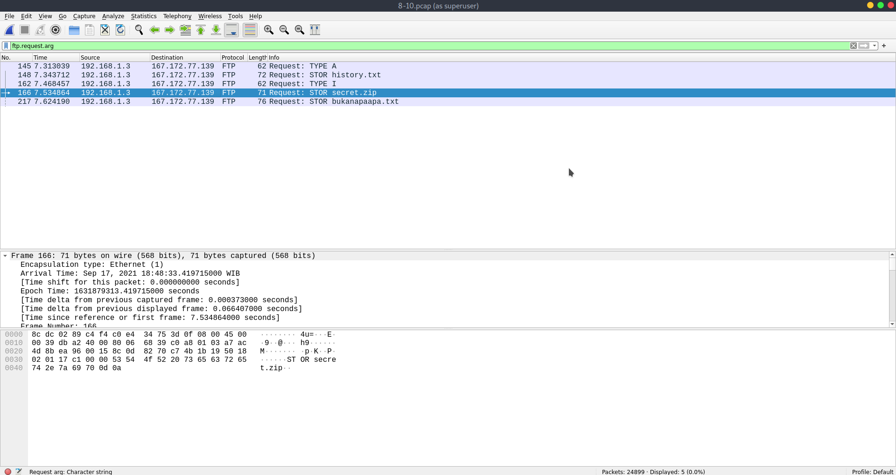
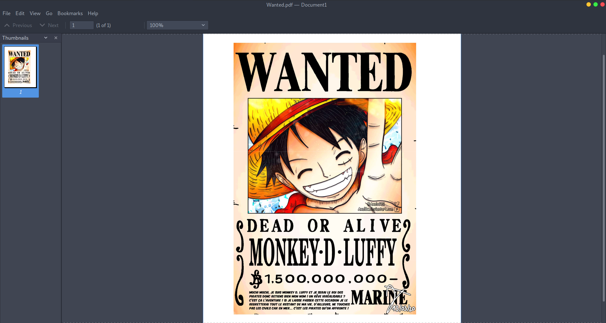
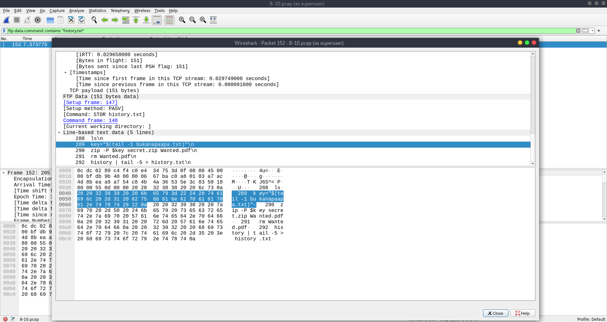
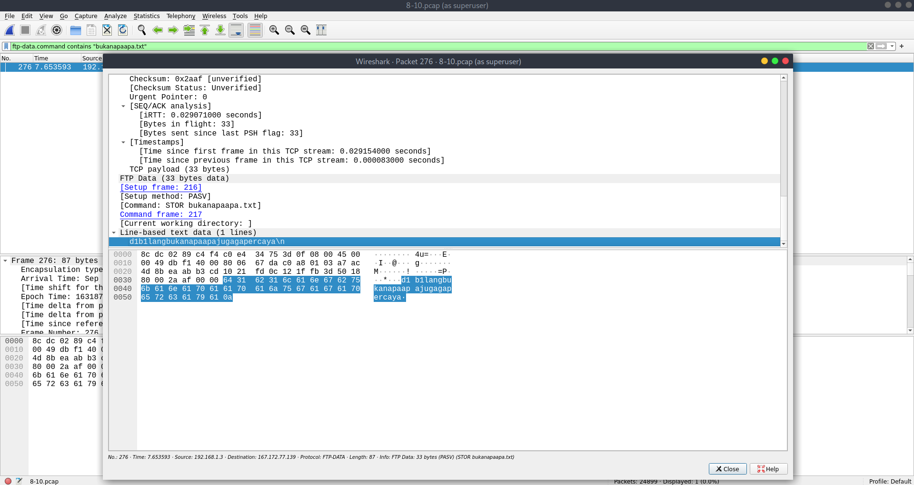

# Jarkom-Modul-1-I02-2021

Made by:

Abyan Ahmad (05111942000013)

Gede Yoga Arisudana (05111942000009)

Zulfiqar Rahman Aji (05111942000019)

## Problem 1
Diplay Filter: `http.request.full_uri contains "ichimarumaru.tech"`

From the image, the webserver is nginx/1.18.0 (Ubuntu)

## Problem 2
Display Filter: `http.authbasic`

## Problem 3
From the authbasic favicon, we can see that the username and password as below

Username: kuncimenujulautan
Password: tQKEJFbgNGC1NCZlWAOjhyCOm6o3xEbPkJhTciZN

## Problem 4
Display Filter: `mysql contains select`

## Problem 5
From the sql files, we can see that the 

Username: akakanomi
Password: pemisah4lautan

## Problem 6
The display filter to find the username is `ftp contains USER`

The display filter to find the password is `ftp contains PASS`

## Problem 7
The display filter to find Real.pdf is `ftp-data contains Real.pdf`

## Problem 8
The display filter to show the retrieval of files is `ftp.request.arg`

## Problem 9
The display filter to find *secret.zip* is `ftp-data.command contains "secret.zip"` and the content inside the zip file is *Wanted.pdf*.

## Problem 10
In order to open the *secret.zip*, we need to find the passsword from *history.txt*. The display filter to find *history.txt* is `ftp-data.command contains "history.txt"`. 

From the image above, we can see that the key of *secret.zip* is in *bukanapaapa.txt*. The display filter to find *bukanapaapa.txt* is `ftp-data.command contains "bukanapaapa.txt"`.

## Problem 11

In problem 11, we are needed to filter so that wireshark only picks up packets coming from port 80, and the key to solve this problem is word `from`, therefore we are going to use a display filter called `src` and then write the port number, thus we will get the capture filter, and the capture filter is `src port 80`

## Problem 12

In problem 12, we are needed to filter so that wireshark only picks up packets containing port 21, and the key to solve this problem is word `containing`, therefore we are going to use only one display filter called `port` and then write the port number, thus we will get the capture filter, and the capture filter is `port 21`

## Problem 13

In problem 13, we are needed to filter so that wireshark only shows packets going to port 443, and the key to solve this problem is word `going`, therefore we are going to use a display filter called `dst` and then write the port number, thus we will get the capture filter, and the capture filter is `dst port 443`

## Problem 14

In problem 14, we are needed to filter so that wireshark only picks up packets going for kemenag.go.id, and the key to solve this problem is word `going`, therefore we are going to use a display filter called `dst` and then write the website link, and don't forget to do some activity in the website so the wireshark can show the picked up packet that are going for kemenag.go.id, thus we will get the capture filter, and the capture filter is `dst host kemenag.go.id`

## Problem 15

In problem 15, we are needed to filter so that wireshark only picks up packets coming from your ip, and the key to solve this problem is word `coming`, therefore we are going to use a display filter called `src` and then write our ip address, and we can get our ip address by typing `ipconfig` in our command prompt, thus we will get the capture filter, and the capture filter is `src host 192.168.0.100`
